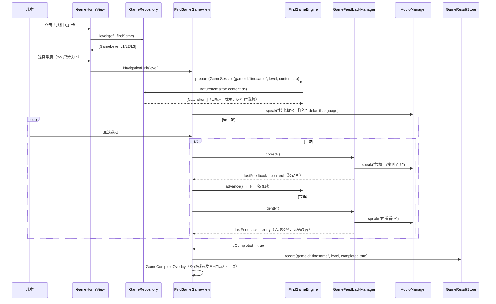
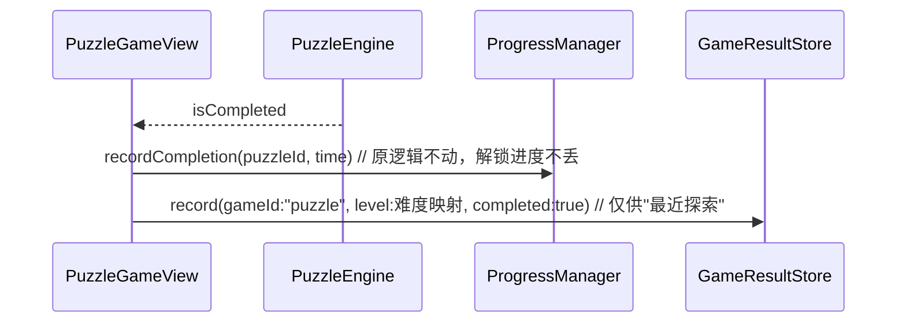

# Grow Phase 5 架构设计：内容扩充 + 趣味游戏中心 + 认知小游戏体系

> 架构师：高见远 ｜ 基于 main 分支现有代码（SwiftUI + MVVM + Repository，iOS 17+，零第三方依赖）
> 设计原则：**最小改动、增量落地、全部复用现有 ContentItem / AudioManager / ProgressManager / DesignSystem**。

---

## 一、现状梳理（设计的出发点）

| 现有资产 | 位置 | 本阶段如何复用 |
|---|---|---|
| `ContentItem` 统一协议 | `Grow/Models/Content.swift` | 游戏内容一律以 nature `Content ID` 引用，不复制内容 |
| `NatureItem` / `nature.json`（78 个对象：水果18/蔬菜18/动物24/植物18，`img:` 插画） | `Grow/Models/Models.swift`、`Grow/Resources/Content/nature.json` | 配对/找相同/分类/拼图的内容唯一来源 |
| `PuzzleEngine`（运行时切片，不落盘） | `Grow/Core/PuzzleEngine.swift` | **原样保留**，拼图零重写 |
| `PuzzleRepository` / `puzzles.json` | `Grow/Core/PuzzleRepository.swift` | 只做 JSON 数据扩充 |
| `ProgressManager`（拼图进度 + 难度解锁，UserDefaults `grow.puzzle.progress`） | `Grow/Core/ProgressManager.swift` | **原样保留**，旧数据不丢；游戏中心新增独立的 GameResultStore |
| `AudioManager`（TTS，普通话/粤语/英语，`speak(name:language:key:)`） | `Grow/Core/AudioManager.swift` | 游戏语音唯一出口，禁止第二套音频 |
| `SoundEffects.PuzzleSound`（AudioServices 系统短音，无刺耳错误音） | `Grow/Core/SoundEffects.swift` | 泛化为 `GameSound`，拼图沿用原枚举 |
| DesignSystem：`Theme` / `GrowFont` / `GrowRadius` / `GrowAnimation` / `GlassComponents` / `ModuleIdentity` | `Grow/DesignSystem/` | 游戏全部 UI 的唯一视觉来源；Glass 只用于操作按钮 |
| `Router`（Tab + 各栈 path + DEBUG `--page=` 深链） | `Grow/Core/Router.swift` | 新增 `GameRoute` + `gamesPath` |
| `GameTabRoot`（目前直接指向 `PuzzleHomeView`） | `Grow/GrowApp.swift` | 改指向趣味游戏首页（一行改动） |

并行协作注意：另一工程师正在改 `Nature` / `Learning` / `Poem` / `Home` 视图与 `AudioManager`。本方案对 `NatureDetailView` 与 `HomeView` 的改动点已压缩到最小并在 §7 标注协调事项。

---

## 二、增量实现方案

### 2.1 新增文件清单

#### `Grow/Core/Game/`（引擎 / 会话 / 反馈 / 进度 —— 纯逻辑，无 UI）

| 文件 | 职责 |
|---|---|
| `GameModels.swift` | `GameType` / `GameDifficultyLevel` / `GameDefinition` / `GameLevel` / `GameLevelConfig` / `GameSession` / `GameResult` 全部数据结构（详见 §3） |
| `GameRepository.swift` | 加载 `games.json`（复用 `JSONLoader`）；查询 `definitions` / `levels(of:)` / `definition(ofType:)`；**内容解析**：`natureItems(for contentIds:)` → 从 `ContentRepository` 取 `NatureItem`（内容唯一来源，不复制） |
| `GameResultStore.swift` | `GameResult` 聚合持久化（UserDefaults key `grow.game.results`，结构 `[ResultKey: GameResult]`）；`recordPlay / recordCompletion / recentExplorations`（供"最近探索"）；与 `ProgressManager` 完全独立、互不干扰 |
| `GameFeedbackManager.swift` | 统一反馈：正确短语池（"找到了！/很棒！/对啦！"）、错误引导语（"再看看～"）；柔和系统短音（扩展 `SoundEffects` 为 `GameSound`）；通过 `AudioManager.speak` 以 `SettingsManager.defaultLanguage` 朗读（粤语模式下提示语同样被 zh-HK voice 朗读）；发布 `@Published lastFeedback` 供视图做轻动画（GrowAnimation 门控） |
| `GameEngine.swift` | `GameEngineProtocol`（`prepare(level:)` / `reset()` / `isCompleted`）+ 共用选题工具 `GameContentPicker`：按 Level 从 `GameRepository` 取内容、洗牌、生成干扰项（供配对/找相同复用，避免三套随机逻辑） |
| `MatchingEngine.swift` | 配对游戏逻辑：N 组卡片翻面配对、状态机（idle/playing/completed）、容错判定 |
| `FindSameEngine.swift` | 找相同逻辑：顶部目标 + 2~6 选项、点选判定、轮次推进 |
| `SortingEngine.swift` | 分类逻辑：待分类物品队列、2 个分类桶、宽松吸附判定（落点距桶中心 < 阈值即成功） |

#### `Grow/Views/Game/`（趣味游戏首页 + 各游戏视图）

| 文件 | 职责 |
|---|---|
| `GameHomeView.swift` | 趣味游戏首页（小游戏选择页，非大厅）：可用游戏大卡（拼图/配对/找相同/分类）+ 第二优先级占位禁用卡（颜色/形状/排序/找不同）+ 底部"最近探索"横条 |
| `GameComponents.swift` | 跨游戏共用 UI：`GameCompleteOverlay`（完成页：图 + 名称 + 发音 + 再玩一次/下一项/认识一下）、`GameIntroTip`（开局说明：图片+声音>文字，大字指令 + 自动 TTS）、`GameOptionCard`（大图选项卡，统一尺寸/圆角/按压缩放） |
| `MatchingGameView.swift` | 配对游戏页（进入→说明→玩→完成→反馈→再玩/下一组） |
| `FindSameGameView.swift` | 找相同游戏页（同上流程） |
| `SortingGameView.swift` | 分类游戏页（拖拽 + 容错吸附，同上流程） |

#### `Grow/DesignSystem/`

| 文件 | 职责 |
|---|---|
| `GameIcons.swift` | 各游戏 Soft 3D 矢量图标（沿用 `ModuleIconView` 的 squircle 容器 + 渐变画法）：拼图（复用 `PuzzleGlyph`）、配对 `MatchingGlyph`、找相同 `FindSameGlyph`、分类 `SortingGlyph`、锁定占位 `LockedGlyph`；`GameModule` 枚举（icon/title/tint/deepTint），**禁止 Emoji 作 UI 图标** |

#### `Grow/Resources/Content/`

| 文件 | 职责 |
|---|---|
| `games.json`（新增） | 游戏注册表 + 各游戏 Level 数据，全部 `content_ids` 引用 nature.json（见 §3.6） |
| `puzzles.json`（扩充） | 拼图源扩充到水果/动物/植物/蔬菜中已有 720×720 原图的对象（纯数据，引擎零改动） |

### 2.2 现有文件最小改动点

| 文件 | 改动 | 规模 |
|---|---|---|
| `GrowApp.swift` | `GameTabRoot` 改为 `NavigationStack(path: $router.gamesPath)` 并注册 `GameRoute` 的 `navigationDestination`；根 `RootTabView` 补 `.environmentObject(gameRepository)`、`.environmentObject(gameResults)` | ~15 行 |
| `Router.swift` | 新增 `enum GameRoute: Hashable { case home, puzzleLevel(PuzzleDifficulty), game(GameType, contentID: String?) }` + `@Published var gamesPath: [GameRoute]` + DEBUG `--page=game:<type>:<contentId>` 深链 | ~20 行 |
| `Models/LearningModels.swift` | `PuzzleDifficulty` 增加 `var gameLevel: GameDifficultyLevel` 映射（easy→L1 / medium→L2 / hard→L3），仅用于游戏中心展示统一难度口径；**不改任何现有字段** | ~8 行 |
| `Core/SoundEffects.swift` | 在 `PuzzleSound` 旁新增 `GameSound`（pick/place/complete 复用同批柔和系统音；错误仍**无声音**，只有语音引导） | ~15 行 |
| `Views/Nature/NatureDetailView.swift` | 简介卡下方新增「玩一玩」区：三个胶囊按钮（拼一拼 / 找相同 / 找朋友-配对），点击 `router.gamesPath.append(...)` 跨 Tab 跳转（`router.tab = .games`） | ~40 行 |
| `DesignSystem/ModuleIdentity.swift` | `GrowModule.puzzle` 的 `title` "拼图世界"→"趣味游戏"、`subtitle` "动手拼一拼"→"拼图 · 配对 · 找相同 · 分类"（首页 4 入口不变，第 4 入口语义升级） | 2 行 |
| `Resources/Content/puzzles.json` | 追加拼图条目（见 §5 Step 3 验收） | 纯数据 |

**不改动**：`PuzzleEngine`、`PuzzleRepository`、`ProgressManager`、`PuzzleHomeView` / `PuzzleLevelView` / `PuzzleGameView`（迁移 = 换挂载点，游戏本体原封不动）、`AudioManager` 公开接口。

---

## 三、数据结构设计（Swift 定义级伪代码）

```swift
// MARK: - Grow/Core/Game/GameModels.swift

/// 游戏类型（本期实现前 4 个；后 4 个仅注册占位）
enum GameType: String, Codable, CaseIterable {
    case puzzle, matching, findSame, sorting          // 本期实现
    case color, shape, ordering, spotDifference       // 占位禁用
}

/// 统一难度口径：Level 1（2 选项/2 物品/大图/明显区别）→ L2（3-4）→ L3（4-6）
/// 禁止用"速度"加难度；拼图映射 4/9/16 片
enum GameDifficultyLevel: Int, Codable, CaseIterable, Identifiable {
    case level1 = 1, level2, level3
    var displayName: String { ["入门", "进阶", "挑战"][rawValue - 1] }
    /// 该档建议选项/物品数（拼图除外）
    var suggestedCount: ClosedRange<Int> {
        switch self { case .level1: return 2...2; case .level2: return 3...4; case .level3: return 4...6 }
    }
}

/// 游戏定义（games.json 顶层条目）
struct GameDefinition: Codable, Identifiable, Equatable {
    let id: String              // "puzzle" / "matching" / ...
    let type: GameType
    let title: String           // "趣味拼图" / "配对" ...
    let icon: String            // 设计系统矢量图标名（GameModule），禁止 emoji
    let description: String     // 一句话说明，供 TTS 与副标题
    let sortOrder: Int
    let isPlaceholder: Bool?    // true = 占位禁用（颜色/形状/...），缺省 false
}

/// 游戏关卡：内容复用铁律 —— 只存 nature Content ID 引用
struct GameLevel: Codable, Identifiable, Equatable {
    var id: String { "\(gameId)_\(level)" }
    let gameId: String                  // 对应 GameDefinition.id
    let level: Int                      // 1/2/3
    let contentIds: [String]            // 引用 nature.json id，如 ["fruit_apple", "animal_panda"]
    let configuration: GameLevelConfig  // 该关玩法参数
}

/// 关卡配置（JSON snake_case，全部可选、按 gameType 取用）
struct GameLevelConfig: Codable, Equatable {
    var optionCount: Int?          // 找相同：选项数 2~6
    var groupCount: Int?           // 配对：2~3 组
    var rounds: Int?               // 找相同/分类：一轮页数
    var categoryPairs: [SortCategoryPair]? // 分类：桶定义
}
struct SortCategoryPair: Codable, Equatable {
    let categoryA: String          // nature category raw，如 "fruit"
    let categoryB: String          // 如 "vegetable"
}

/// 一局会话（进入游戏页时构建，退出即释放，不持久化）
struct GameSession {
    let gameId: String
    let level: GameDifficultyLevel
    let contentIds: [String]
    let startedAt: Date
    /// 退出/换关时调用：置 nil 断开 UI 引用，配合 @StateObject 生命周期释放图片内存
}

/// 游戏结果（聚合持久化；儿童端只展示"最近探索"，无金币/积分/排名）
struct GameResult: Codable, Equatable {
    let gameId: String
    let level: Int
    var completed: Bool            // 该关是否至少完成过一次
    var playCount: Int
    var completedCount: Int
    var lastPlayedAt: Date?
    var lastCompletedAt: Date?
}
/// 存储键："\(gameId)_\(level)"；UserDefaults key: "grow.game.results"
```

### 与现有系统的衔接方式

| 现有系统 | 衔接点 |
|---|---|
| **ContentItem 协议** | 游戏只持有 `contentIds: [String]`；`GameRepository.natureItems(for:)` 从 `ContentRepository.shared.natureItems`（已实现 `ContentItem`）解析出 `NatureItem`（nameZh/nameEn/illustration 均可直接用）。游戏模型自身**不实现** ContentItem，避免派生内容 |
| **LearningRepository** | 本期不直接使用（游戏内容全部来自 nature）；`GameRepository` 预留 `resolver: (String) -> (any ContentItem)?` 闭包，未来数字/拼音内容可零结构变更接入 |
| **ProgressManager** | **不迁移、不改写**。拼图解锁/完成仍走 `grow.puzzle.progress`；`GameResultStore` 只为游戏中心记录 play/complete 计数与"最近探索"。拼图完成时**双写**：`ProgressManager.recordCompletion`（不动）+ `GameResultStore.record(gameId: "puzzle", ...)`（在 PuzzleGameView 完成分支加一行） |
| **AudioManager** | `GameFeedbackManager` 与各游戏页的所有语音统一走 `AudioManager.shared.speak(name:language:key:)`，language 取 `SettingsManager.shared.defaultLanguage`（粤语模式下指令语自然被 zh-HK voice 朗读）；TTS key 规范 `"game-\(gameId)-\(purpose)"`。不新建任何播放器/音频文件 |
| **SettingsManager** | 复用 `ageMode`（2-3 岁默认 Level1、更大选项）、`reduceMotion/animationOn`（GrowAnimation 已门控）、`buttonScaleFactor/fontScaleFactor` |

---

## 四、各游戏页面结构与交互流程

### 4.0 通用流程（全部游戏一致）

```
进入 → GameIntroTip（大图 + 一句指令 + AudioManager 自动朗读，图片+声音>文字）
     → 玩（大操作区 / 宽松拖拽 / 容错吸附 / 无倒计时）
     → 每次操作 → GameFeedbackManager（正确：轻动画+柔和音+正向语音；错误：仅"再看看～"语音引导，无错误音无红叉）
     → 完成 → GameCompleteOverlay（成品大图 + 名称三语发音 + "认识一下"深链自然详情 + 再玩一次 / 下一项）
     → 退出（返回）→ session 释放、audio.stop()、图片缓存随 @StateObject 释放
```

`GameCompleteOverlay` 由 `GameComponents.swift` 提供，四游戏共用；`onNext` 的"下一项"由各 View 提供（同关换内容 / 换下一关），拼图继续用现有 `PuzzleCompleteView`（保留"认识一下"联动，不重复造）。

### 4.1 拼图（迁移，零重写）

- **迁移方式 = 换挂载点**：`GameTabRoot` 根视图 `PuzzleHomeView` → `GameHomeView`；`GameHomeView` 的拼图大卡 `NavigationLink → PuzzleHomeView()`（现有三级结构 难度→列表→游戏 完整保留）。
- 解锁进度：`ProgressManager` 不动，`PuzzleHomeView` 的 `isUnlocked` 逻辑照旧生效 → **旧用户数据零丢失**。
- 唯一代码增量：`PuzzleGameView.handleDrop` 完成分支补一行 `GameResultStore.shared.record(gameId: "puzzle", level: currentItem.difficulty.gameLevel, completed: true)`（双写，供"最近探索"展示）。
- 内容扩充：仅 `puzzles.json` 追加条目（水果/动物/植物/蔬菜中已有 720×720 原图的对象，每个对象按需配 easy/medium/hard），`source_nature_item_id` 保持内容关联。

### 4.2 配对（MatchingGameView + MatchingEngine）

- **玩法**：翻面配对。Level1 = 2 组（4 张大卡）、Level2 = 3 组（6 张）、Level3 = 3 组 + 图片差异更小。
- **数据**：`GameLevel.contentIds` 给出本关参与的 N 个对象 → `GameContentPicker` 复制两份洗牌成卡面。
- **交互**：2-3 岁容错——点第 1 张翻开，点第 2 张：相同 → 两张锁定 + 反馈"找到了！"+ 朗读对象名；不同 → 停留 0.8s 后轻合上，反馈"再看看～"（无错误音）。全部配对成功 → 完成页。
- **页面结构**：顶部 GameIntroTip 指令（"找出一样的朋友"）→ 大卡网格（adaptive minimum 130）→ 完成覆盖层。

### 4.3 找相同（FindSameGameView + FindSameEngine）

- **玩法**：顶部目标大图 + 下方 2~6 选项，点选与目标相同的图。Level1 = 2 选项（差异明显）、Level2 = 3-4、Level3 = 4-6（同类别近似物）。`rounds` 轮后完成。
- **数据**：目标 = `contentIds[轮次]`；干扰项 = `GameContentPicker.distractors(for: target, count:)` 从同类别其他对象选（明显差异由 Level 决定是否跨类别）。
- **交互**：点对 → 选项打勾锁定 + "很棒！" + 朗读名称 → 自动进入下一轮；点错 → 该选项轻晃（GrowAnimation 门控）+ "再看看～"，可继续点。
- **页面结构**：上 40% 目标卡（`GameOptionCard` 特大号）→ 下半选项网格（2 列，Level3 3 列）→ 完成覆盖层。

### 4.4 分类（SortingGameView + SortingEngine）

- **玩法**：拖动底部物品到两个分类桶。本期两组桶：水果/蔬菜、动物/植物。
- **数据**：`categoryPairs` 定义桶（映射 `NatureCategory`，颜色用 `Theme.categoryColor`）；物品从 `contentIds` 对应类别的 `NatureItem` 中按 Level 抽取：L1 = 每类 1 个（2 物品大图）、L2 = 每类 2 个、L3 = 共 4-6 个。
- **交互**：沿用拼图拖拽范式（`DragGesture` + 命中区宽松判定：落点距桶中心 < 桶宽 60% 即算入桶；命中任一桶时桶轻放大力反馈）。放对 → 物品落入桶 + "对啦！" + 朗读名称；放错 → 弹回原位 + "再看看～"（与 PuzzleGameView 错误处理一致的温和回弹）。全部分完 → 完成页。
- **页面结构**：上部两个大桶（各占半宽，高 ≥ 200pt）→ 下部物品托盘（横向滚动，卡 ≥ 90pt）→ 完成覆盖层。

### 4.5 自然详情页「玩一玩」打通

- `NatureDetailView` 简介卡下新增区块：三个按钮「拼一拼」「找相同」「找朋友」，各带 Soft 3D 小图标。
- 点击 → `router.tab = .games` + `router.gamesPath = [.game(.puzzle/.findSame/.matching, contentID: item.id)]`。
- 游戏页接收 `contentID` 时：拼图 → 定位到包含该内容的难度/条目；找相同/配对 → 以该内容为目标构建一局（同类别补齐干扰项/配对项），跳过选择页直接开玩。

### 4.6 趣味游戏首页（GameHomeView）

- 结构：`GlassPageHeader("趣味游戏", subtitle: "玩一玩 · 认一认")` → 2×2 大卡网格（拼图/配对/找相同/分类，`GameModule` 图标 + tint，样式对齐 `GlassEntryCard` 但主区域不用玻璃、用 `growCard` 实底保证清晰明亮）→ 占位禁用区（颜色/形状/排序/找不同：`LockedGlyph` + "敬请期待"，opacity 0.6、不可点）→ "最近探索"横条（`GameResultStore.recentExplorations` 解析 nature 名称，空态隐藏）。
- Glass 仅用于：页头右侧帮助按钮、各游戏页的返回/重玩/下一项操作按钮（`GlassIconButton` / `GlassButton`）。

---

## 五、程序调用流程（时序图）

### 5.1 从游戏首页进入「找相同」并完成一局



### 5.2 自然详情页「玩一玩」深链（Router）

```mermaid
sequenceDiagram
    participant U as 用户
    participant ND as NatureDetailView
    participant R as Router
    participant GT as GameTabRoot
    participant GV as 游戏视图(拼/找相同/配对)

    U->>ND: 点击「找相同」(玩一玩)
    ND->>R: tab = .games; gamesPath = [.game(.findSame, contentID:"fruit_apple")]
    R-->>GT: NavigationStack(gamesPath) 变化
    GT->>GV: navigationDestination → FindSameGameView(contentID:"fruit_apple")
    GV->>GV: 以 fruit_apple 为目标、同类别补干扰项，直接开玩
    Note over GV: 返回时 onDisappear：audio.stop()、session 释放
```

### 5.3 拼图完成双写（兼容旧数据）



---

## 六、任务列表（按实现顺序）

| # | 任务 | 涉及文件 | 依赖 | 验收标准 |
|---|---|---|---|---|
| **Step 1** | 趣味游戏首页 + 游戏数据层 | `GameModels.swift`、`games.json`、`GameRepository.swift`、`DesignSystem/GameIcons.swift`、`GameHomeView.swift`、`Router.swift`、`GrowApp.swift`、`ModuleIdentity.swift` | 无 | 游戏 Tab 打开为趣味游戏首页；4 个可玩游戏卡 + 4 个禁用占位卡；首页 4 入口语义不变（第 4 入口改名"趣味游戏"）；`--page=game:home` 深链可达；禁用卡不可点、无跳转崩溃 |
| **Step 2** | 通用引擎协议 / 反馈 / 进度 | `GameEngine.swift`、`GameFeedbackManager.swift`、`GameResultStore.swift`、`Core/SoundEffects.swift`、`Views/Game/GameComponents.swift` | Step 1 | `GameFeedbackManager` 正确/错误反馈可用（柔和音 + TTS 粤/国跟随设置）；`GameResultStore` 读写 UserDefaults 并能列出最近探索；`GameCompleteOverlay` 可复用展示 |
| **Step 3** | 拼图迁移 + puzzles.json 扩充 | `GameHomeView.swift`（拼图卡接 `PuzzleHomeView`）、`PuzzleGameView.swift`（+1 行双写）、`puzzles.json`、`LearningModels.swift`（难度映射） | Step 2 | 游戏中心 → 拼图 → 原三级流程完整可用；**卸载重装模拟旧进度场景：`grow.puzzle.progress` 解锁状态保持**；puzzles.json 新条目均能开局（图片 720×720 校验通过）；完成时最近探索出现拼图记录 |
| **Step 4** | 配对游戏 | `MatchingEngine.swift`、`MatchingGameView.swift`、`games.json`（matching levels） | Step 2 | L1=2组/L2=3组；翻面配对正确锁定+正向反馈、错误温和合上；完成页可"再玩一次/下一组"；粤语模式提示语为粤语朗读 |
| **Step 5** | 找相同游戏 | `FindSameEngine.swift`、`FindSameGameView.swift`、`games.json`（findSame levels） | Step 2 | L1=2选项/L2=3-4/L3=4-6；干扰项来自同类别不重复；点对推进、点错仅引导；`--page=game:findsame:fruit_apple` 直达 |
| **Step 6** | 分类游戏 | `SortingEngine.swift`、`SortingGameView.swift`、`games.json`（sorting levels） | Step 2 | 水果/蔬菜、动物/植物两组桶；宽松吸附（桶宽 60% 容错）；放对入桶+朗读、放错弹回；Reduce Motion 开启时无弹跳动画 |
| **Step 7** | 自然详情打通 + 完整测试 | `NatureDetailView.swift`（玩一玩区）、全量回归 | Step 3-6 | 详情页三按钮跨 Tab 跳转正确；四游戏进出 10 次无内存持续增长（Instruments 验证图片缓存释放）；reduceMotion/动画开关全场景无异常；深链矩阵（`--tab=games --page=game:*`）全通过 |

依赖图：Step 1 → Step 2 → {Step 3, 4, 5, 6} → Step 7（4/5/6 相互独立可并行）。

---

## 七、共享知识 / 跨文件约定

1. **命名**：游戏域统一前缀 `Game*`（模型/引擎/仓库）；视图 `XxxGameView`；引擎 `XxxEngine`。文件内 `// MARK: -` 分区与现有风格一致。
2. **内容引用铁律**：任何游戏数据只允许出现 nature `Content ID`（`contentIds` / `categoryPairs`），出现图片路径或派生文案即为违规。
3. **语音规范**：TTS key = `"game-\(gameId)-\(purpose)"`（如 `game-findsame-instruct`）；语言一律 `SettingsManager.shared.defaultLanguage`；音量语速随全局设置，不自建 AVSpeechSynthesizer。
4. **音效规范**：只用 `GameSound`（AudioServices 柔和短音：pick 1104 / place 1057 / complete 1025）；**错误操作无任何音效**，只有语音引导。
5. **反馈短语池**（GameFeedbackManager 内唯一维护）：正确 = ["找到了！", "很棒！", "对啦！"]；错误 = ["再看看～", "换个地方试试～"]。随机取用、避免连续重复。
6. **颜色/图标注册**：新游戏图标一律在 `DesignSystem/GameIcons.swift` 以 `GameModule` 枚举注册（tint 沿用 `Theme.soft*` 系或新增低饱和 `Theme.softGame*`，须同时给 deep 色）；任何视图不得内联硬编码颜色；UI 图标禁用 Emoji（完成页 ✨ 等装饰性例外沿用现有 PuzzleCompleteView 风格）。
7. **玻璃使用边界**：游戏主操作区（拼图板/卡网格/分类桶）只用 `growCard` 实底；`glassSurface/GlassButton` 仅限返回、重玩、下一项、帮助等悬浮操作。
8. **难度口径**：UI 展示统一用 `GameDifficultyLevel.displayName`（入门/进阶/挑战）；拼图 4/9/16 片映射 L1/L2/L3，不引入"速度""计时"要素（bestTime 字段保留但游戏中心不展示）。
9. **持久化 key**：游戏结果 `grow.game.results`；不得复用/改写 `grow.puzzle.progress`。
10. **内存约定**：源图/切片/选项图只存 `@State`/引擎内缓存，`onDisappear` 释放（`sourceImage = nil`、engine 置空），遵循 PuzzleGameView 现有模式。

---

## 八、待明确事项（需产品澄清）

1. **720×720 校验**：puzzles.json 扩充对象需逐一确认资产尺寸；若部分对象非 720×720（如早期插画），拼图切片会模糊——建议工程侧用脚本校验 assets 目录后再扩数据。
2. **详情页「找朋友」命名**：配对游戏在游戏中心叫「配对」，详情页入口需求原文为「找朋友-配对」——按钮文案取「找朋友」还是「配对」？本设计暂定按钮「找朋友」。
3. **分类 Level3 形态**：L3 是"每类 3 个（共 6 物品）"还是引入第三类？本设计按"2 类 × ≤3 个 = 4-6 物品"执行，若需三桶模式需产品确认。
4. **占位游戏的可见性**：颜色/形状/排序/找不同以"敬请期待"禁用态展示在首页底部；若产品希望本期完全隐藏，只需 `GameHomeView` 过滤 `isPlaceholder == true`，一行改动。
5. **与并行改造的合并**：`NatureDetailView`（玩一玩区）与 `HomeView`（入口文案）正被另一工程师修改视觉——建议其合入后我方 rebase，仅追加独立区块，冲突面极小；`AudioManager` 若其有接口变更，`GameFeedbackManager` 依赖的仅 `speak(name:language:key:)` 与 `playingKey`，接口稳定。
6. **"下一项"策略**：找相同/配对完成后的"下一项"默认= 同关换一批内容；是否需要"自动升级到下一关"？本设计暂不自动升级（尊重 2-3 岁重复偏好），由儿童/家长手动选难度。
